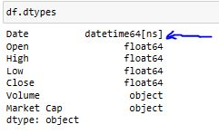

# Project Description

_______________________________________________________
The project aims to analyze Bitcoin's price fluctuations from 2013 to 2017, focusing on changes in stock price and closing rates. By using advanced data analysis techniques, it seeks to uncover trends and patterns that drive Bitcoin's market behavior.

### Skills/ concepts demonstrated: 

The codes were executed using **Jupyter notebook**.
- **Pandas :-** Collect and modify data
- **Numpy :-** Carry out numeric features
- **Matplotlib :-** Base model for data visualization
- **Seaborn :-** Beautiful and fast plots
- **Ploty :-** Dynamic plot

### Read Data for Analysis

### Data Transformation
Data pre-processing/Data cleaning was carried out.
- **Checking for duplicated values**   
- **Checking for missing values**   
- **Converting the "Date" column to a _data-time_ data type from _object_ data type**      
- **Sorting**   
  
### Problem Statement:
What was the change in price of the stock overtime?
_______________________________________________________________________________________
 

### Problem Statement:
Analysing open, high, low, close values of Bitcoin
___________________________________________________________________________________
 

### Problem Statement:
Analysing closing price in-depth!
___________________________________________________________________________________
 

### Problem Statement:
Display closing price on yearly, quarterly, monthly basis
___________________________________________________________________________________
- **Yearly**   
- **Quarterly**   
- **Monthly**   

### Observation
After year 2015, there was a sharp increase on the closing prices.
